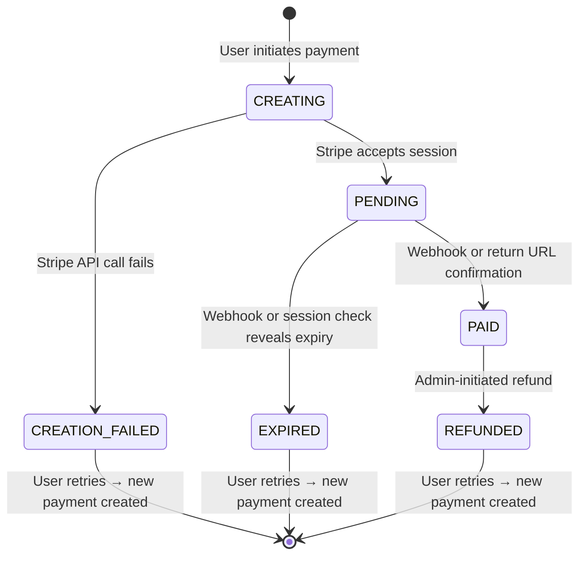

# Payment State Machine

This document describes the state machine for Stripe Checkout Session payments.

## States

| State | Description |
|-------|-------------|
| `CREATING` | Payment record created locally, Stripe API call in progress |
| `PENDING` | Checkout Session created in Stripe, awaiting user payment |
| `PAID` | Payment completed successfully |
| `EXPIRED` | Checkout Session expired without payment |
| `CREATION_FAILED` | Stripe API rejected the session creation |
| `REFUNDED` | Payment refunded by an admin |

## State Diagram

## Data Model

### Signup

| Field | Description |
|-------|-------------|
| `price` | Total price the user agreed to pay at confirmation time |
| `currency` | Currency code (e.g., `EUR`) |
| `products` | Snapshot of selected products/quantities at confirmation |
| `manualPaymentStatus` | Payment status set manually by admin (PAID, REFUNDED), or NULL |

These fields are updated when the user confirms their signup or modifies it.

### Payment

| Field | Description |
|-------|-------------|
| `status` | Current state (CREATING, PENDING, PAID, EXPIRED, CREATION_FAILED, REFUNDED) |
| `amount` | Amount charged, copied from signup at payment creation |
| `currency` | Currency code, copied from signup |
| `products` | Products snapshot, copied from signup at payment creation |
| `stripeCheckoutSessionId` | Stripe Checkout Session ID (set on transition to PENDING) |
| `expiresAt` | When the Checkout Session expires |
| `completedAt` | When payment was completed (for PAID status) |

The payment's `amount` and `products` provide an audit trail of what was actually charged, independent of any later signup modifications.

## Payment Flow

### Initial Payment Creation

1. User initiates payment
2. Backend creates a `Payment` record in `CREATING` state
3. Backend calls Stripe API to create a Checkout Session
4. On success: transition to `PENDING`, store Checkout Session ID
5. On any failure: transition to `CREATION_FAILED` (user can retry)

### Payment Completion

Payments transition from `PENDING` to `PAID` or `EXPIRED` via:

- **Webhook**: Stripe sends `checkout.session.completed` or `checkout.session.expired`
- **Return URL**: User returns from Stripe, backend verifies session status

Use `UPDATE ... WHERE status = 'pending'` and check the affected row count to handle races between webhook and return URL.

### Handling Existing Payments

When a user attempts to pay and a payment record already exists:

| Current State | Action |
|---------------|--------|
| `CREATING` | Fail request (TODO: retry with idempotency key if new enough) |
| `PAID` | No action needed; update UI to reflect paid status |
| `PENDING` | Check session status in Stripe. If pending, redirect. Otherwise, update payment and act accordingly. |
| `EXPIRED` | Create a new payment |
| `CREATION_FAILED` | Create a new payment |
| `REFUNDED` | Create a new payment |

Note: `CREATING` is a transient state that only exists during API calls. Users should not encounter it.

### Refunds

Refunds are handled manually by an admin through the Stripe dashboard. The admin then updates the payment status to `REFUNDED`. There is no automated refund flow.

### Manual Payments

For events with manual payment handling (e.g., cash, invoice, bank transfer), admins can set `manualPaymentStatus` on the signup directly without creating a `Payment` record. This field uses `ManualPaymentStatus` enum: `PAID` or `REFUNDED`.

When an admin marks a signup as manually paid, any existing Checkout Session must be expired to prevent double payment. This transitions the `Payment` record to `EXPIRED`.

### Effective Payment Status

The `Signup.effectivePaymentStatus` getter determines the signup's payment status:

1. If paid via online payment OR manually → `PAID`
2. If signup has no price → `null`
3. If an active `Payment` record exists → map its status via `paymentStatusMap`
4. If `manualPaymentStatus` is set → map via `manualPaymentStatusMap`
5. Otherwise (has price but no payment) → `PENDING`

## Database Constraints

The following constraints are enforced at the database level:

- **Unique active payment**: A partial unique index on `signupId` for payments in CREATING, PENDING, or PAID states. Only one "active" payment can exist per signup. Multiple EXPIRED, CREATION_FAILED, or REFUNDED records are permitted.

- **Session ID consistency**: A CHECK constraint ensures `stripeCheckoutSessionId` is set if and only if `status IN ('pending', 'paid', 'expired', 'refunded')`. Payments in CREATING or CREATION_FAILED states must have a NULL session ID.

- **State transition validation**: A trigger enforces valid state transitions:
  - `CREATING` → `PENDING` or `CREATION_FAILED`
  - `PENDING` → `PAID` or `EXPIRED`
  - `PAID` → `REFUNDED`
  - Terminal states (`EXPIRED`, `CREATION_FAILED`, `REFUNDED`) cannot transition further

- **Immutable fields**: A trigger prevents updates to `id`, `signupId`, `amount`, `currency`, `products`, `expiresAt`, `completedAt`, and `createdAt`.

- **Session ID set once**: A trigger allows `stripeCheckoutSessionId` to be set once (NULL → value) but prevents changes.

- **No deletions**: A trigger prevents all DELETE operations on the payment table.

## Background Jobs

### Stale PENDING Polling

- Finds payments in `PENDING` state past their `expiresAt` time
- Queries Stripe for the actual session status
- Transitions to `PAID` or `EXPIRED` accordingly
- Catches webhook delivery failures

## Current Limitations

- **Modifying signups after payment**: Once a signup is paid, the user cannot edit it. This avoids complexity around partial refunds and price recalculations.
- **Automated refunds**: Not supported. Refunds must be processed manually via Stripe dashboard.

## Edge Cases

### Stuck in CREATING State

If the server crashes after creating the payment record but before completing the Stripe call, the payment remains in `CREATING`. This is an edge case that should be rare in practice. A background job can periodically mark stale `CREATING` payments (e.g., older than 5 minutes) as `CREATION_FAILED` to allow users to retry.

### Webhook Delivery Failures

Stripe webhooks can be delayed or fail. Mitigations:
- The return URL flow provides a backup check
- The background job polls Stripe for stale PENDING payments
- Stripe retries webhooks, so transient failures self-heal

### Duplicate Webhooks

Stripe may send the same webhook multiple times. The `UPDATE ... WHERE status = 'pending'` pattern ensures only the first attempt transitions the state; subsequent attempts see zero affected rows and are no-ops.

### Session Expiry During Payment

If the user is on Stripe's payment page when the session expires, Stripe handles this gracefully. On return, we check status and create a new session if needed.

### Stripe API Errors

All Stripe API errors (network failures, validation errors, server errors) result in the payment being marked as `CREATION_FAILED`. The user can simply retry, which creates a new payment record. This simplifies error handling and avoids leaving payments in an ambiguous state.

### Signup Deletion with Active Payment

The foreign key constraint (ON DELETE RESTRICT) prevents deleting a signup that has any payment records. To delete such a signup, the admin must first handle the payment situation (e.g., refund if paid, or wait for expiry if pending).

### Zero Price Signups

If a signup's total price is zero (e.g., free event or 100% discount), no payment should be created. This is handled at the application layer before initiating the payment flow.

### Concurrent Admin Actions

If two admins try to refund the same payment simultaneously, the `UPDATE ... WHERE status = 'paid'` pattern ensures only one succeeds. The other sees zero affected rows and should report the payment was already refunded.

### Signup Updates

The payment system uses **pessimistic locking** to prevent race conditions between signup updates and payment creation.

#### Problem

With READ COMMITTED isolation, two race conditions can occur:

1. **Payment using stale data:** User updates signup (price changes from $100 to $50) while payment is being created. Payment could capture $100 and create a Stripe session for the wrong amount.

2. **Outdated payments after signup update:** User has a PENDING Stripe session for $100, then updates their signup to $50. The old Stripe session remains active and could charge the wrong amount.

#### Solution: Pessimistic Locking

**Approach:**
- Signup row is locked with FOR UPDATE during updates
- Payment creation waits for this lock when fetching signup data
- Ensures fresh data is always used
- Lock duration is kept short, no API calls within transactions

**Direction 1 - Protect Payment Creation:**

When creating a payment:
1. Load signup for initial validation of preconditions
2. **BEGIN TRANSACTION**
3. Re-fetch signup with FOR UPDATE lock (waits if update in progress)
4. Create Payment record with fresh price/currency/products
5. **COMMIT TRANSACTION** (releases lock)
6. Call Stripe API (no locks held, no transactions)
7. Transition Payment to PENDING

**Direction 2 - Protect Signup Updates:**

When updating signup:
1. Find and expire any existing CREATING or PENDING payments (in Stripe, then database)
2. **BEGIN TRANSACTION**
3. Fetch signup with FOR UPDATE lock
4. Check for any CREATING/PENDING/PAID payments (defensive)
5. If found, fail with error
6. Update signup
7. **COMMIT TRANSACTION** (releases lock)
